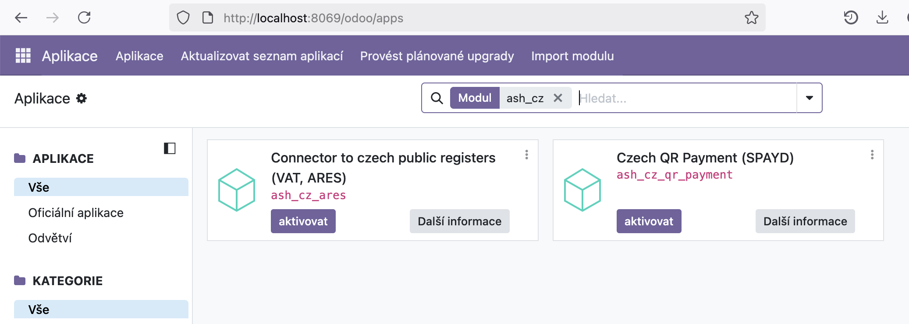

🇬🇧 [English version](README.md)

# Česká lokalizace Odoo – Rozšíření (ARES, QR platby a ověřování plátců)

Tento repozitář obsahuje moduly rozšiřující standardní systém Odoo o specifické funkce pro český trh. Cílem je automatizovat zakládání partnerů, zajistit správnost fakturačních údajů a zjednodušit platební procesy.

## Dostupné moduly
* [Veřejné rejstříky (ARES, Registr plátců DPH)](./ash_cz_ares) (ash_cz_ares)
* [České QR kódy pro bankovní platby](./ash_cz_qr_payment) (ash_cz_qr_payment)

## Instalace modulů
V Odoo v modulu Aplikace nejprve ve vyhledávacím poli vypněte filtr na "Aplikace" a následně do něj zadejte text "ash_cz". To zobrazí všechny moduly z tohoto balíčku. Výsledek bude vypadat podobně jako na obrázku:

Následně už jen kliknete na "Aktivovat" u těch modulů, které chcete nainstalovat.

---

## O projektu

Tyto moduly jsou vyvíjeny a spravovány společností **[Ash technology s.r.o.](https://www.ashtechnology.eu)**, oficiálním partnerem Odoo v České republice.

Moduly jsou zdarma a open-source. Uvítáme vaši zpětnou vazbu a návrhy na vylepšení – pokud váš nápad pomůže komunitě, rádi ho zapracujeme.

**Kontakt:**
- Web: [www.ashtechnology.eu](https://www.ashtechnology.eu)
- Email: info@ashtechnology.eu

Pro zakázkový vývoj v Odoo nebo větší projekty nás neváhejte kontaktovat.

---

*Odoo je ochranná známka společnosti Odoo S.A.*
