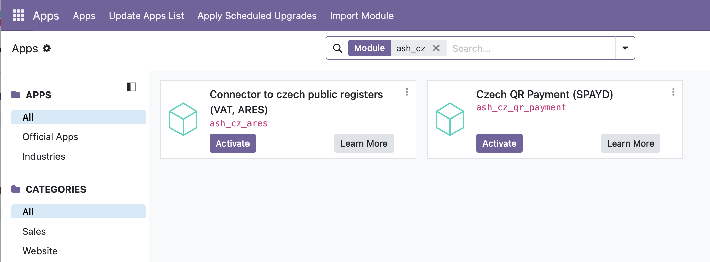

🇨🇿 [Česká verze](README.cs.md)

# Czech Localization for Odoo – Extensions (ARES, QR Payments & VAT Verification)

This repository contains modules that extend the standard Odoo system with specific functionality for the Czech market. The goal is to automate partner creation, ensure accuracy of invoicing data, and simplify payment processes.

## Available Modules

* [Public Registers (ARES, VAT Payer Registry)](./ash_cz_ares) (ash_cz_ares)
* [Czech QR Codes for Bank Payments](./ash_cz_qr_payment) (ash_cz_qr_payment)

## Installation

In Odoo, go to the Apps module. First, disable the "Apps" filter in the search field, then enter "ash_cz". This will display all modules from this package. The result will look similar to this:

Then simply click "Activate" on the modules you want to install.

---

## About

This module is developed and maintained by **[Ash technology s.r.o.](https://www.ashtechnology.eu)**, an official Odoo partner based in the Czech Republic.

These modules are free and open-source. We welcome your feedback and feature requests – if your idea benefits the community, we're happy to include it.

**Contact us:**
- Web: [www.ashtechnology.eu](https://www.ashtechnology.eu)
- Email: info@ashtechnology.eu

For custom Odoo development or larger projects, feel free to reach out.

---

*Odoo is a trademark of Odoo S.A.*
