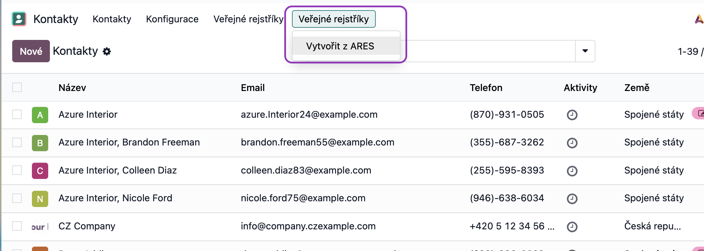
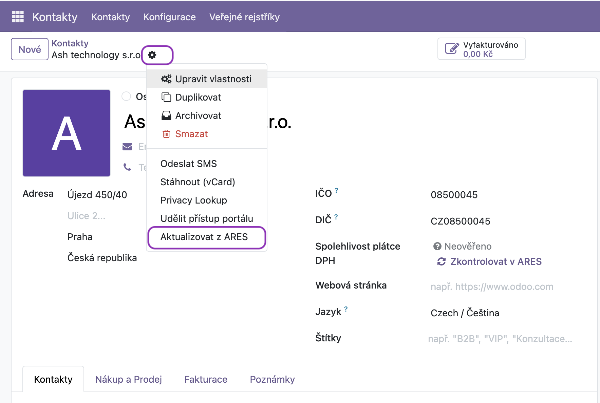
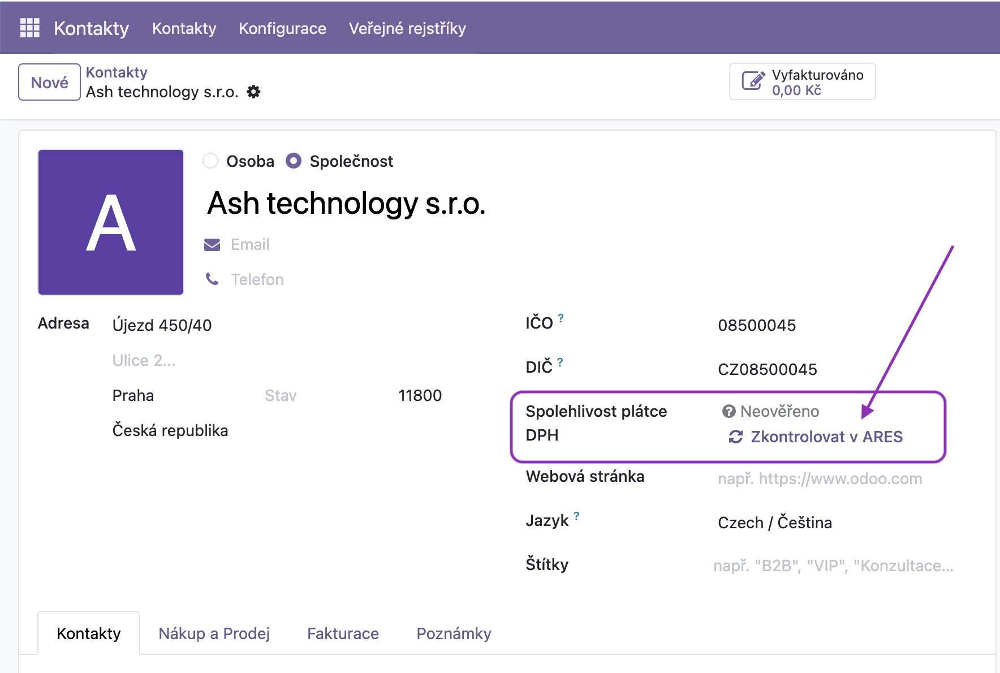
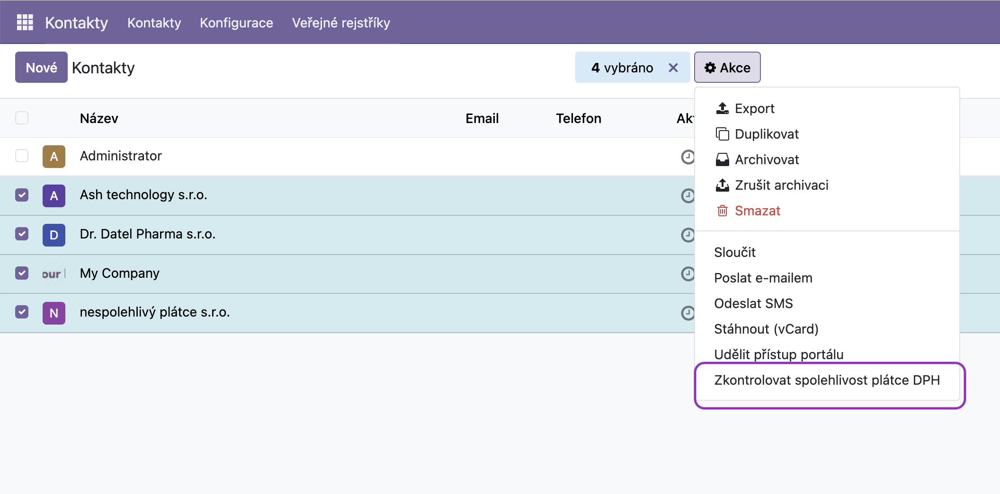

🇬🇧 [English version](README.md)

# Modul Veřejné rejstříky (ARES, Registr plátců DPH)
## 1. Aktualizace základních údajů
Modul umožňuje založit nového partnera podle IČ, nebo v případě, že používáte funkci "Partner autocomplete", ověřit adresu a název podle ARES.

* **Kde najdete:** V aplikaci Kontakty v horní liště: **Veřejné rejstříky > Vytvořit z ARES**.

* Funkce je dostupná také z aplikace **Fakturace z menu Zákazníci**
* **Funkčnost:** Stačí zadat osmi místné IČO. Systém se spojí s registrem ARES a automaticky vyplní:
    * Obchodní jméno
    * Kompletní adresu (včetně správného formátování ulice a čísel)
    * DIČ (pokud je subjekt plátcem)
    * IČO do pole "Company Registry"

* **Aktualizace stávajícího kontaktu:** Na kartě konkrétního partnera naleznete pod ozubeným kolem akci **Aktualizovat z ARES**, která aktualizuje údaje bez nutnosti znovu zadávat IČO.

## 2. Ověřování spolehlivosti plátce DPH
U každého českého partnera systém sleduje stav spolehlivosti v registru DPH:
* **Neověřeno (šedá):** Kontrola u tohoto partnera zatím neproběhla.
* **Spolehlivý plátce (zelená):** Subjekt je řádně registrovaný a bez negativního záznamu.
* **Nespolehlivý plátce (červená):** Subjekt je označen jako nespolehlivý. V tomto případě se na kartě partnera zobrazí výrazná **červená stuha (ribbon)**.

## 3. Hromadné akce
* **Hromadná kontrola:** V seznamu kontaktů (List View) můžete označit více záznamů a přes tlačítko **Akce > Zkontrolovat spolehlivost plátce DPH** aktualizovat stav všech najednou.

## Často kladené dotazy (FAQ)

**Proč se mi nezobrazuje tlačítko "Vytvořit z ARES"?**
Ujistěte se, že máte nainstalovanou aplikaci Fakturace nebo Kontakty a že váš uživatel má příslušná oprávnění.

**Jak systém pozná nespolehlivého plátce?**
Systém volá oficiální API registru plátců DPH (veřejná část je dostupná na adrese https://adisspr.mfcr.cz/adis/jepo/epo/dpr/apl_ramce.htm?R=/dpr/DphReg?ZPRAC=FDPHI1%26poc_dic=2%26OK=Zobraz)

---

## O modulu

Tento modul je vyvíjen a spravován společností **[Ash technology s.r.o.](https://www.ashtechnology.eu)**, oficiálním partnerem Odoo v České republice.

Modul je zdarma a open-source. Uvítáme vaši zpětnou vazbu a návrhy na vylepšení – pokud váš nápad pomůže komunitě, rádi ho zapracujeme.

**Kontakt:**
- Web: [www.ashtechnology.eu](https://www.ashtechnology.eu)
- Email: info@ashtechnology.eu

Pro zakázkový vývoj v Odoo nebo větší projekty nás neváhejte kontaktovat.

---

*Odoo je ochranná známka společnosti Odoo S.A.*

