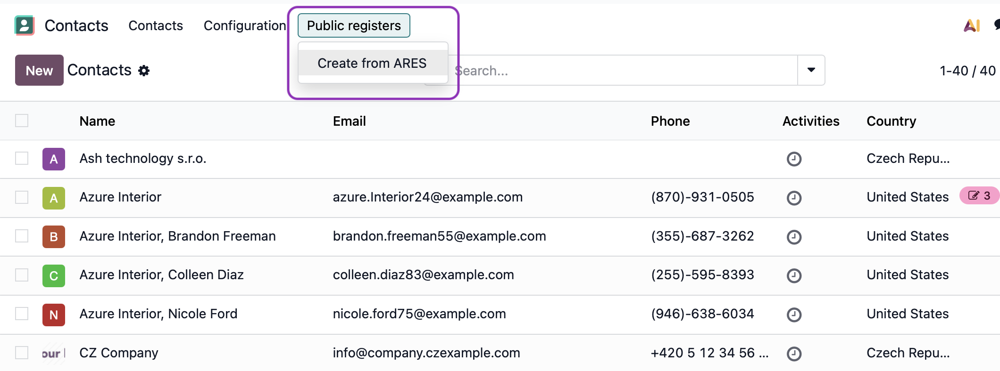
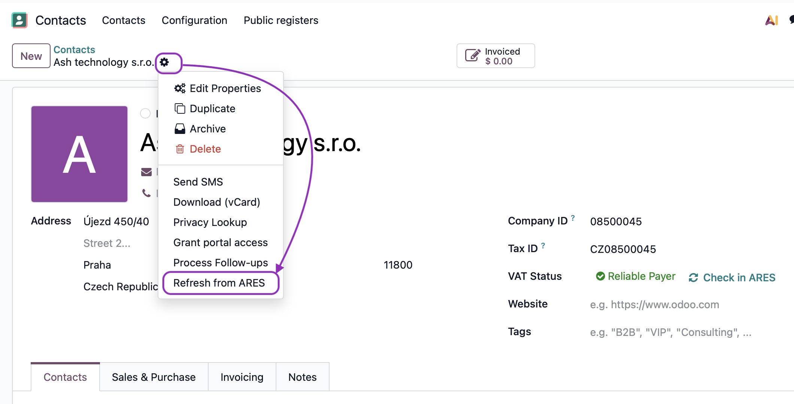
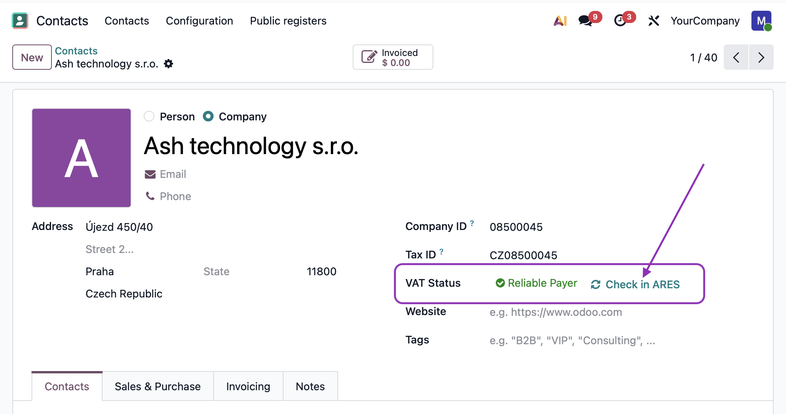
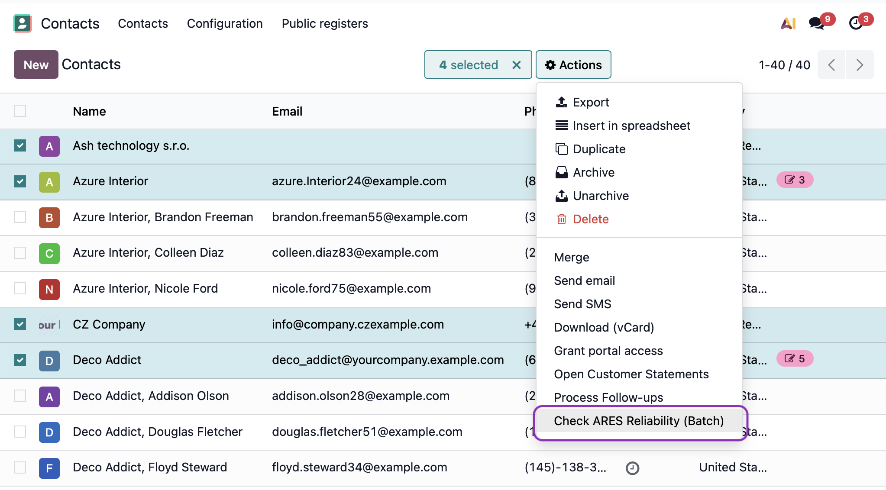

🇨🇿 [Česká verze](README.cs.md)

# Public Registers Module (ARES, VAT Payer Registry)

## 1. Automatic Data Retrieval

This module allows you to create a new partner by their Company ID (IČO), or if you use the "Partner Autocomplete" feature, verify the address and name against ARES.

* **Where to find it:** In the Contacts app, in the top menu bar: **Public Registers > Create from ARES**.

* The feature is also available from the **Invoicing app in the Customers menu**
* **How it works:** Simply enter the 8-digit Company ID (IČO). The system connects to the ARES registry and automatically fills in:
    * Business name
    * Complete address (including proper street and number formatting)
    * VAT ID (if the entity is a VAT payer)
    * Company ID into the "Company Registry" field

* **Updating an existing contact:** On a specific partner's card, you'll find the action **Update from ARES** under the gear icon, which updates the data without needing to re-enter the Company ID.

## 2. VAT Payer Reliability Verification

For each Czech partner, the system tracks their reliability status in the VAT registry:
* **Not verified (gray):** Verification has not yet been performed for this partner.
* **Reliable payer (green):** The entity is properly registered with no negative records.
* **Unreliable payer (red):** The entity is marked as unreliable. In this case, a prominent **red ribbon** is displayed on the partner's card.

## 3. Batch Operations

* **Batch verification:** In the contact list (List View), you can select multiple records and use the **Action > Check VAT Payer Reliability** button to update the status of all selected partners at once.

## Frequently Asked Questions (FAQ)

**Why don't I see the "Create from ARES" button?**
Make sure you have the Invoicing or Contacts app installed and that your user has the appropriate permissions.

**How does the system identify an unreliable payer?**
The system calls the official VAT payer registry API (the public part is available at https://adisspr.mfcr.cz/adis/jepo/epo/dpr/apl_ramce.htm?R=/dpr/DphReg?ZPRAC=FDPHI1%26poc_dic=2%26OK=Zobraz)

---

## About

This module is developed and maintained by **[Ash technology s.r.o.](https://www.ashtechnology.eu)**, an official Odoo partner based in the Czech Republic.

These modules are free and open-source. We welcome your feedback and feature requests – if your idea benefits the community, we're happy to include it.

**Contact us:**
- Web: [www.ashtechnology.eu](https://www.ashtechnology.eu)
- Email: info@ashtechnology.eu

For custom Odoo development or larger projects, feel free to reach out.

---

*Odoo is a trademark of Odoo S.A.*
