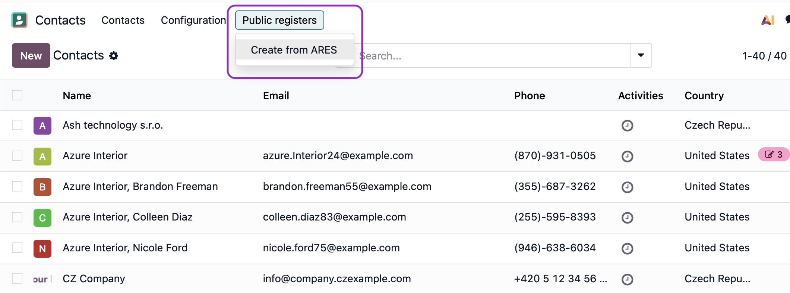
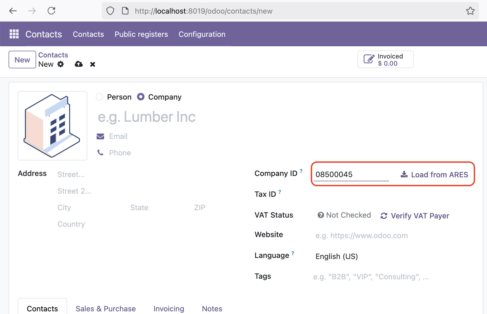
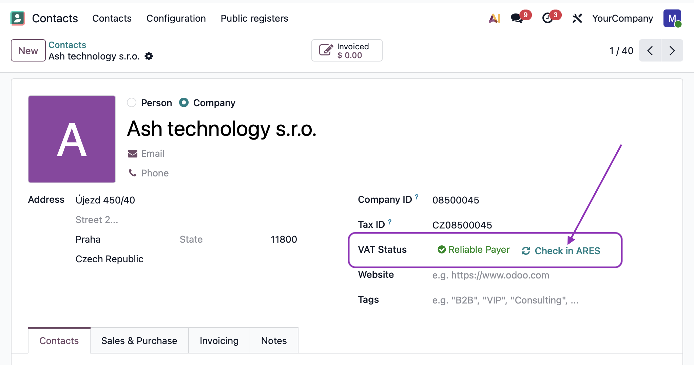
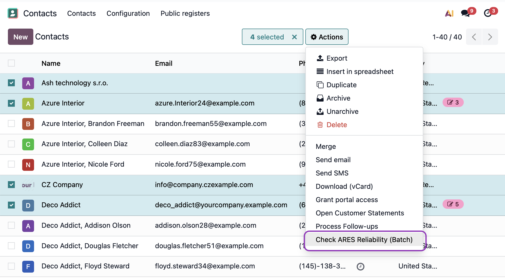

🇨🇿 [Česká verze](README.cs.md)

# Public Registers Module (ARES, VAT Payer Registry)
## 1. Automatic Data Retrieval
This module allows you to create a new partner by their Company ID (IČ), or if you use the "Partner Autocomplete" feature, verify the address and name against ARES.

* **Where to find it:** In the Contacts app, in the top menu bar: **Public Registers > Create from ARES**.

* The feature is also available from the **Invoicing app in the Customers menu**
* Finally, you can enter the IČ directly in the contact form and click the **Load from ARES** button next to the IČ:

If another contact already has this IČ, the system warns you. The IČ field is shown for Czech partners and for partners without a country.

* **How it works:** Simply enter the 8-digit IČ. The system connects to the ARES registry and automatically fills in:
    * Business name
    * Complete address (including proper street and number formatting)
    * VAT ID (if the entity is a VAT payer)
    * IČ into the "Company ID" field

* **Updating an existing contact:**
In the contact form, check the IČ and click **Load from ARES** as described above. The system overwrites the contact's data with the values from ARES. The data is filled into the form and saved only when you save the contact.

* **VAT group members:**
If the company is a member of a VAT group, the VAT ID of the group (e.g. CZ699004572) is loaded from ARES into the "VAT" field, because the member's own VAT ID is not valid for VAT. The reliability is then verified for the VAT ID of the group.

## 2. VAT Payer Reliability Verification
For each Czech partner, the system tracks their reliability status in the VAT registry:
* **Not verified (gray):** Verification has not yet been performed for this partner.
* **Reliable payer (green):** The entity is properly registered with no negative records.
* **Not a VAT payer (orange):** The entity is not in the VAT payer registry. Contacts created from ARES get this status automatically and have no VAT ID filled in.
* When data is loaded from ARES, VAT payers are verified automatically. If the VAT registry is unavailable, the data is still filled in, the status stays "Not verified" and you are asked to run **Verify VAT Payer** later.
* **Unreliable payer (red):** The entity is marked as unreliable. In this case, a prominent **red ribbon** is displayed on the partner's card.

## 3. Batch Operations
* **Batch verification:** In the contact list (List View), you can select multiple records and use **Action > Check ARES Reliability (Batch)** to update the status of all selected partners at once.

## Frequently Asked Questions (FAQ)

**Why don't I see the "Create from ARES" button?**
Make sure you have the Invoicing or Contacts app installed and that your user has the appropriate permissions.

**How does the system identify an unreliable payer?**
The system calls the official VAT payer registry API (the public part is available at https://adisspr.mfcr.cz/adis/jepo/epo/dpr/apl_ramce.htm?R=/dpr/DphReg?ZPRAC=FDPHI1%26poc_dic=2%26OK=Zobraz)

---

## About

This module is developed and maintained by **[Ash technology s.r.o.](https://www.ashtechnology.eu)**, an official Odoo partner based in the Czech Republic.

These modules are free and open-source. We welcome your feedback and feature requests – if your idea benefits the community, we're happy to include it.

**Contact us:**
- Web: [www.ashtechnology.eu](https://www.ashtechnology.eu)
- Email: info@ashtechnology.eu

For custom Odoo development or larger projects, feel free to reach out.

---

*Odoo is a trademark of Odoo S.A.*
