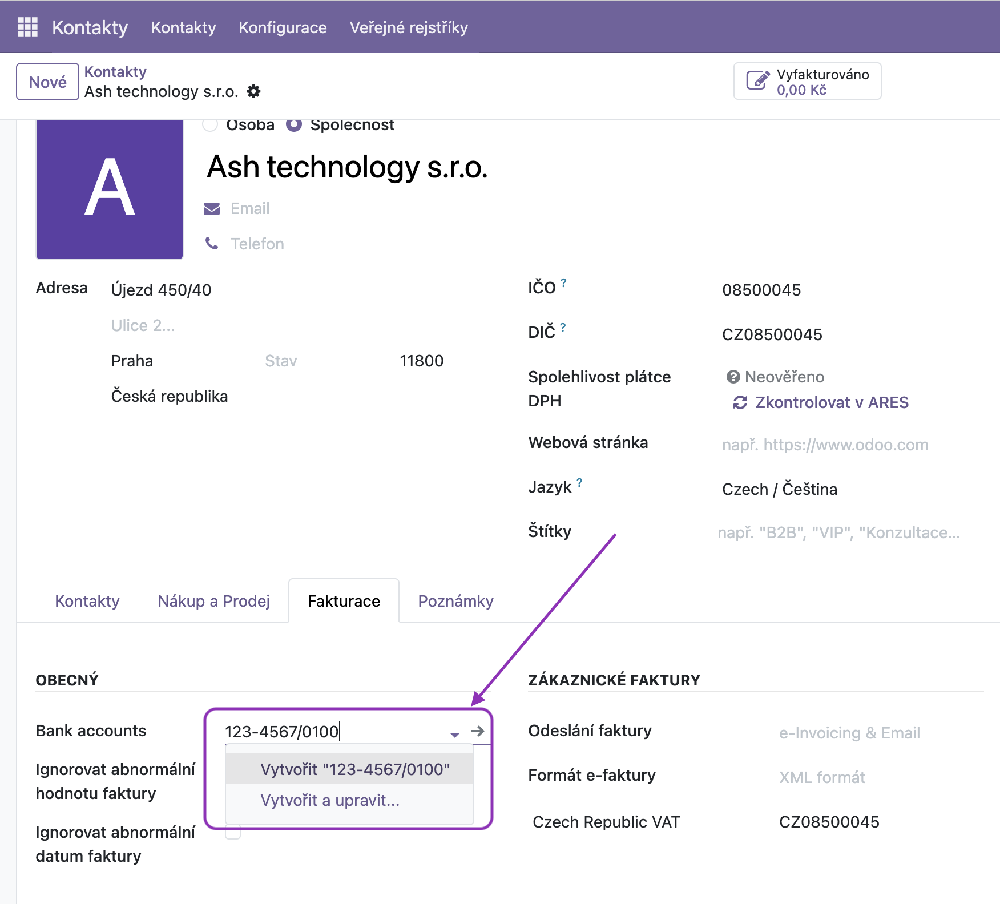
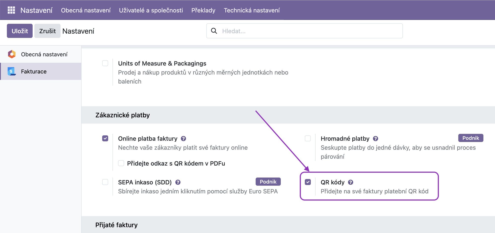

🇨🇿 [Česká verze](README.cs.md)

# Czech QR Payments

This module adds QR codes to invoices for quick mobile payments. The codes are in SPAYD format, compatible with all major Czech banking apps.

* **Bank account format:** Enter Czech bank accounts in the standard Odoo field using the Czech format, e.g., `123-456/0800`

* **Foreign accounts:** For foreign accounts, you can enter IBAN in the same field (standard Odoo field).
* **Currency support:** Czech QR codes are generated for invoices in CZK currency. For foreign payments, the original Odoo QR code is preserved.

## Frequently Asked Questions (FAQ)

**The QR code is not generated on the invoice**
Make sure you have the **QR Codes** option enabled in the **Invoicing** app configuration.

**The QR code is generated on the invoice, but scanning it results in an error**
Check whether a bank account for the Czech currency is set up for the main company. See "Bank account format" section above.
---

## About

This module is developed and maintained by **[Ash technology s.r.o.](https://www.ashtechnology.eu)**, an official Odoo partner based in the Czech Republic.

These modules are free and open-source. We welcome your feedback and feature requests – if your idea benefits the community, we're happy to include it.

**Contact us:**
- Web: [www.ashtechnology.eu](https://www.ashtechnology.eu)
- Email: info@ashtechnology.eu

For custom Odoo development or larger projects, feel free to reach out.

---

*Odoo is a trademark of Odoo S.A.*
